[](https://deepwiki.com/eyor-gech/Data-Contract-Enforcer)
# Data Contract Enforcer

**Schema Integrity & Lineage Attribution System**

## Overview

This project implements a **data contract enforcement system** that generates, validates, and maps contracts for structured datasets. It ensures **schema integrity, rule enforcement, and failure detection** across multiple stages of a data platform.

The system is built around core components:
* **Contract Generation** → infers rules from real data
* **Contract Validation** → enforces rules against datasets
* **Schema Evolution** → diffs snapshots and generates migration instructions
* **AI Extensions** → detects prompt anomalies, drift, and formatting regressions
* **Lineage & Attribution** → traces root cause and blast radius through graphs

---

## Architecture

```
Source Data → ContractGenerator → Generated Contracts → ValidationRunner → Validation Reports
                                      ↓
                                   dbt Mapping → dbt Tests
```

### Data Flow Diagram

```mermaid
graph LR
    %% Systems
    W1[W1: Intent Records]
    W2[W2: Verdicts]
    W3[W3: Extractions]
    W4[W4: Cartographer]
    W5[W5: Event Store]
    LS[LangSmith Monitoring]

    %% Data Flow with schema/artifact annotations
    W1 -- "IntentRecord {intent_id, trace_id, actor}" --> W2
    W2 -- "ModelVerdict {trace_id, model_scores}" --> W3
    W3 -- "ExtractionRecord {doc_id, extraction_id}" --> W4
    W4 -- "EventRecord {source, recorded_at}" --> W5
    W5 -- "Telemetry {trace_id, latency_ms}" --> LS

    %% Group the core pipeline
    subgraph "Core Data Pipeline"
        W1
        W2
        W3
        W4
        W5
    end
```



---

## Project Structure

```
contracts/
  generator.py        # 1) Data-driven contract generation
  runner.py           # 2) Contract validation engine
  schema_analyzer.py  # 3) Schema evolution and diff detection 
  ai_extensions.py    # 4) AI semantic constraints & embeddings
  report_generator.py # Report rendering
attributor.py         # 5) Lineage graph mapping & git blame
contract_registry/    
  subscriptions.yaml  # Inter-system dependencies
```

---

## Key Features

### 1. Data-Driven Contract Generation
* Infers rules from dataset profiling: Required fields (null analysis), Unique identifiers, Enumerations (low-cardinality flags), Numeric ranges (robust quantiles).
* Uses statistical baselines to persistently store numeric constraints for comparisons.
* Produces **machine-checkable contract artifacts**.

### 2. Rich Contract Rules
* Structural: `not_null`, `unique`, `enum`, `regex`, `range`.
* Semantic: `relationships`, `monotonic_increasing`, `token_math`, `weighted_score_math`.
* Domain-specific constraints (e.g., event payload valid schema validation).

### 3. Failure Mode Coverage & Attribution
* Explanatory attribution chains linking exact `commit_hash` paths matching the specific downstream errors identified.
* Schema drift classifications identifying missing fields.

---

## End-to-End Execution (Fresh Clone)

This guide explains how to run each of the **five core entry-point scripts** end-to-end on a fresh repository clone. The scripts evaluate all elements of the framework and output their results dynamically.

### Pre-requisites (Data Setup)
Before executing the pipeline, ensure the base data exists by running the bootstrap data generator:
```powershell
python scripts/week7_bootstrap.py --cloned-root "."
```

---

### Step 1: ContractGenerator
This script generates machine-readable YAML contracts from input data sources by automatically inferring field rules, ranges, required flags, and schemas. It will also map tests identically into `dbt` schema files.

**Command:**
```powershell
python contracts/generator.py --source outputs/week3/extractions.jsonl --output generated_contracts
```

**Expected Output:**
```
[OK] wrote contract: generated_contracts\week3_extractions.yaml
[OK] wrote dbt schema: generated_contracts\week3_extractions.schema.yml
```
*(The generator also stores numeric properties persistently in `schema_snapshots/baselines.json`.)*

---

### Step 2: ValidationRunner
This script validates data natively against the constructed contracts. It catches structural violations, computes statistical drift baselines natively, and assigns severity scales matching outputs dynamically via validation paths.

**Command:**
```powershell
python contracts/runner.py --contract generated_contracts/week3_extractions.yaml --data outputs/week3/extractions.jsonl --mode STRICT
```

**Expected Output:**
You will see a printed JSON digest matching execution success, and a detailed file will be written to disk:
```json
{"total_records": 50, "failed_records": 0, "pass_rate": 1.0, "total_rules": 25, "rules_failed": 0, "rows_affected": 0, "failure_rate": 0.0}
```
*(A detailed output file is generated at `validation_reports/week3_extractions.json` logging every passing check and mapping all explicit rules evaluated.)*

---

### Step 3: SchemaEvolutionAnalyzer
This script classifies schema versions tracking the changes structurally across components, generating rollback migrations natively for downstream subscribers. Let's create two snapshots of our contract and then run the report diff generator natively.

**Command:**
1. Create a baseline snapshot:
```powershell
python contracts/schema_analyzer.py snapshot --contract generated_contracts/week3_extractions.yaml
```
*(Optionally modify the contract file and run snapshot again to simulate schema drift)*
2. Run snapshot again:
```powershell
python contracts/schema_analyzer.py snapshot --contract generated_contracts/week3_extractions.yaml
```
3. Generate the Migration Report:
```powershell
python contracts/schema_analyzer.py report-latest --contract generated_contracts/week3_extractions.yaml
```

**Expected Output:**
```
reports\schema_migration_reports\week3_extractions_migration_report.yaml
reports\schema_migration_reports\week3_extractions_migration_report.pdf
```
*(These files detail whether the change is `COMPATIBLE` or `BREAKING`, the affected downstream consumers mapping contamination impacts explicitly, and a generated checklist tracking rollbacks.)*

---

### Step 4: AI Contract Extensions
This script introduces three exclusive Semantic checks: calculating Embedding Drifts natively via `L2-hash vector` geometries, validating Prompt outputs against `Draft202012Validator` frameworks, and monitoring `LLM Rate Schemas` dynamically over historical windows.

**Command:**
```powershell
python contracts/ai_extensions.py
```

**Expected Output:**
The script successfully completes with no terminal output, but writes heavily into the system:
1. Generates `validation_reports/ai_extensions.json` containing embedding L2 tests mapped directly.
2. Identifies prompt defects scaling structures dropping isolated variables into `outputs/quarantine/traces_runs_inputs_invalid.jsonl`.
3. Monitors `LLM Constraints` tracking historical schemas routing limits iteratively via appends to `validation_reports/week2_violation_rate_history.jsonl`.

---

### Step 5: ViolationAttributor
This script bridges topology trees matching lineage boundaries with downstream validation faults natively. It computes graph hops, queries `contract_registry/subscriptions.yaml`, evaluates explicit `contamination_depths` iteratively via BFS logic, and isolates exact developer commits dynamically using `git` integrations locally tracking explicit upstream authors.

**Command:**
```powershell
python attributor.py --dataset week3_extractions --lineage outputs/week4/lineage_snapshots.jsonl --registry contract_registry/subscriptions.yaml --violation-report validation_reports/week3_extractions.json --out enforcer_report/attribution.json
```

**Expected Output:**
```
enforcer_report\attribution.json
```
*(This JSON file defines a detailed `blame_chain` resolving exact commits matching constraints dynamically arrayed perfectly to 5 maximum candidates, combined alongside `blast_radius_detailed` variables computing topological networks sequentially derived via `contamination_depth` mappings.)*

---

### End-to-End Success Reporting (Optional Step 6)
To view the aggregated health score, system risk, and actionable remediation files, run:
```powershell
python contracts/report_generator.py --out-dir enforcer_report
```
*Outputs: `enforcer_report/report_data.json` and a visually distinct `enforcer_report/enforcer_report.pdf` documenting complete score logic natively!*

---

## Author
Eyor Getachew
Data Scientist | Data Platform Engineer
Week 7 — Data Contract Enforcer (Production-Ready)
