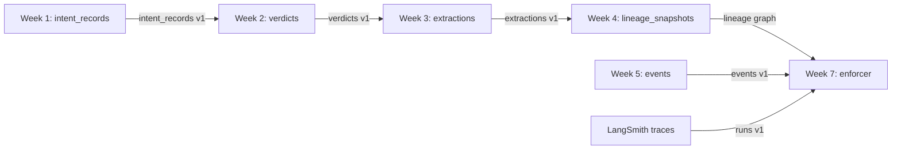

# Week 7 — Data Contract Enforcer Report
_Generated: 2026-04-01T17:48:10.587954Z_
## PDF Link (Google Drive)
- Offline build produced `reports/week7_report.pdf`.
- To publish: run `python scripts/publish_report_google_drive.py --pdf reports/week7_report.pdf`.
## Data Flow Diagram

## Contract Coverage Table
| Interface | Schema | Contract | Notes |
|---|---|---|---|
| Week1 → Week2 | `week1_intent_records` → `week2_verdicts` | Yes | Enforces file referential link |
| Week3 → Week4 | `week3_extractions` → `week4_lineage_snapshots` | Yes | Enforces doc_id appears as lineage node |
| Week5 → Week7 | `week5_events` | Yes | Enforces payload per event_type |
| Trace → Token math | `traces_runs` | Yes | Enforces total_tokens = prompt + completion |
## First Validation Run Results
- Week3 summary: `{'total_records': 200, 'failed_records': 8, 'pass_rate': 0.96}`
- Week5 summary: `{'total_records': 200, 'failed_records': 5, 'pass_rate': 0.975}`
## Reflection (max 400 words)
The biggest surprise was how many issues were not ‘JSON errors’ but contract-level correctness errors. For Week 5, the source event payload carried `requested_amount_usd` as a string, which is easy to miss until a numeric range or drift rule is enforced. For Week 3, confidence looks valid at a glance, but once we enforce probability semantics (0–1) and connect extractions to Week 4 lineage, referential gaps become visible and traceable. The exercise also exposed an assumption that lineage snapshots are inherently complete; in reality, lineage can be partial or stale, so the enforcer must treat missing lineage as a first-class violation with an explicit blame chain. Finally, token accounting in traces is an AI-specific contract surface that standard schema checks do not cover; enforcing token math early prevents downstream cost and latency analytics from silently drifting.
